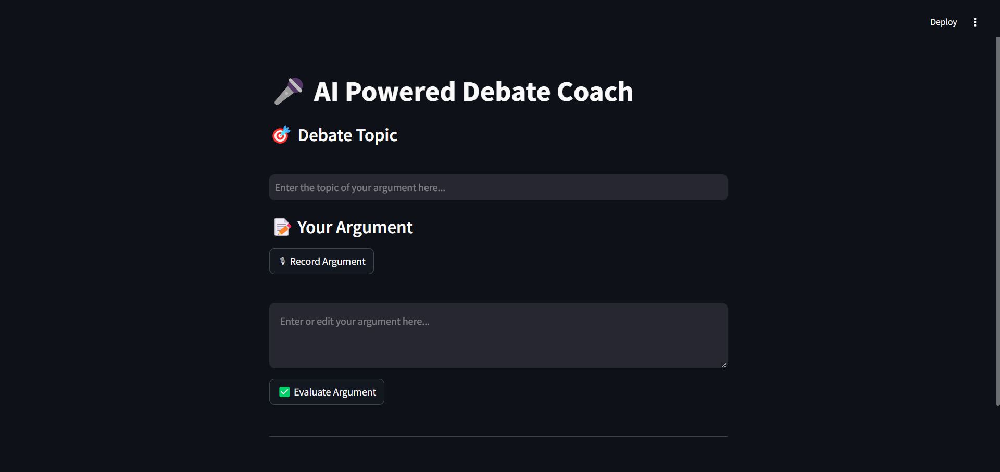
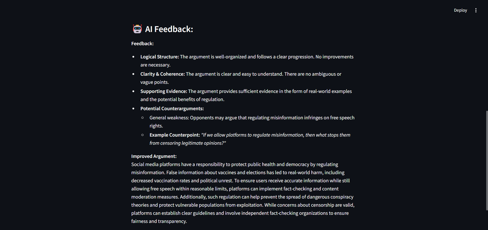

# 🎤 AI-Powered Debate Coach

## 📝 Overview

AI-Powered Debate Coach is a web application designed to help users improve their debate arguments using AI-driven feedback and a rationality meter. It allows users to record or type their arguments, receive AI-powered analysis, and refine their statements based on logical feedback.

 <!-- Upload a screenshot of the UI showing a full analysis -->

---

## 🌟 Features

✅ **Speech-to-Text**: Converts spoken arguments into text.  
✅ **Manual Editing**: Users can refine their argument before submission.  
✅ **AI-Powered Feedback**: Evaluates arguments based on **logic, clarity, evidence, and counterarguments**.  
✅ **Rationality Meter**: Scores arguments on a **scale of 0 (emotional) to 1 (rational)**.  
✅ **Web-Based Interface**: Built using **Flask (Backend) & Streamlit (Frontend)**.  
✅ **Google Gemini AI Integration**: Provides in-depth argument analysis.  
✅ **Deployed Online**: Access the tool via a live URL.

 <!-- Screenshot of the recording button in action -->

---

## 🎯 How It Works

1️⃣ **Enter a debate topic**  
2️⃣ **Record your argument (or type it manually)**  
3️⃣ **Submit for AI evaluation**  
4️⃣ **View rationality score & AI feedback**  
5️⃣ **Improve your argument based on the feedback**


 <!-- Screenshot showing AI feedback in action -->


---

## 🛠️ Tech Stack

### **Backend**

- **Flask** (Handles API requests)
- **Google Gemini API** (AI-powered argument analysis)
- **SpeechRecognition** (Speech-to-text conversion)

### **Frontend**

- **Streamlit** (User interface)
- **Requests** (API communication)

### **Deployment**

- **Railway** (Flask API hosting)
- **Streamlit Cloud** (Frontend hosting)

---

## 📂 Project Structure

📦 AI-Powered-Debate-Coach
│-- 📁 speech_samples/ # Stores recorded speech files
│-- 📜 app.py # Flask backend API
│-- 📜 frontend.py # Streamlit frontend
│-- 📜 requirements.txt # Project dependencies
│-- 📜 .gitignore # Prevents sensitive files from being tracked
│-- 📜 README.md # Project documentation

---

## 🚀 Installation & Setup

### **1️⃣ Clone the Repository**

```bash
git clone https://github.com/STBreeze/AI-Debate-Coach.git
cd AI-Debate-Coach
```

### **2️⃣ Create & Activate a Virtual Environment**

**Windows**

```bash
python -m venv venv
venv\Scripts\activate
```

**macOS/Linux**

```bash
python3 -m venv venv
source venv/bin/activate
```

### **3️⃣ Install Dependencies**

```bash
pip install -r requirements.txt
```

### **4️⃣ Set Up Environment Variables**

```bash
GEMINI_API_KEY=your_api_key_here
```

⚠️ Do **NOT** commit your .env file to GitHub. It contains sensitive API keys.

### **5️⃣ Run the Application Locally**

**Start Flask Backend (Frontend runs automatically)**

```bash
python app.py
```

### ⚠️ Important Notice - Flask Port Already in Use

If you **run `python app.py` multiple times without properly stopping the previous instance**, you may encounter this error: `Address already in use`

🔹 **Why does this happen?**

- When you stop the app using `CTRL + C`, sometimes Flask and Streamlit do **not fully release the port** (e.g., `5000` or `8501`).
- This prevents the app from restarting correctly.

🔹 **How to Fix It?**

1. **Find & Kill the Process Using the Port:**

   - **Windows (Command Prompt / PowerShell):**
     ```bash
     netstat -ano | findstr :5000
     ```
     Find the **Process ID (PID)** from the output, then run:
     ```bash
     taskkill /PID <PID> /F
     ```
   - **Mac/Linux (Terminal):**
     ```bash
     lsof -i :5000
     ```
     Find the **Process ID (PID)** and kill it:
     ```bash
     kill -9 <PID>
     ```

2. **Alternative Quick Fix:**
   - Close your terminal & restart your system
   - Or manually **change the port** in `app.py`:
     ```python
     app.run(debug=True, port=5001)  # Use a different port if needed
     ```

💡 **Best Practice:** Always **fully stop the app** before running `python app.py` again! 🚀

## ✨ Contributing

Want to improve this project? Feel free to submit a pull request! 🚀

## 📜 License

This project is licensed under the **GNU Affero General Public License v3.0 (AGPL-3.0)**.
For full details, see the [LICENSE](LICENSE) file or read the complete license here:  
🔗 [https://www.gnu.org/licenses/agpl-3.0.en.html](https://www.gnu.org/licenses/agpl-3.0.en.html)
